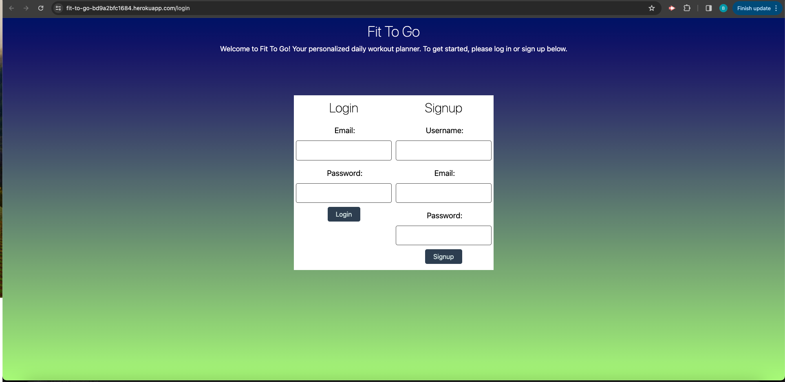

# Fit-To-Go

## User Story
AS an aspiring fitness enthusiast, 
I want a simple way to learn new workouts based on the areas of my body that I am targeting,
SO I can become a healthier me.

## Acceptance Criteria
- Use Node.js and Express.js to create a RESTful API.
- Use Handlebars.js as the templating engine.
- Use MySQL and the Sequelize ORM for the database.
- Have both GET and POST routes for retrieving and adding new data.
- Be deployed using Heroku (with data).
- Use at least one new library, package, or technology that we haven’t discussed.
- Have a polished UI.
- Be responsive.
- Be interactive (i.e., accept and respond to user input).
- Have a folder structure that meets the MVC paradigm.
- Include authentication (express-session and cookies).
- Protect API keys and sensitive information with environment variables.
- Have a clean repository that meets quality coding standards (file structure, naming conventions, follows best practices for class/id naming conventions, indentation, quality comments, etc.).
- Have a quality README (with unique name, description, technologies used, screenshot, and link to deployed application).

## Description
- What was your motivation?
Our motivation for creating this application was to give users a way of personalizing their own workout plan for the week by picking whatever workouts they want to do for each day, Monday-Sunday. 
- Why did you build this project?
This helps those who need organized schedulong in their lives when it comes to working out each day.
- What problem does it solve?
This application solves the problem of not having to go into a workout session withouty knowing what exercises you will be doing, but having a clear list of the exercises you want to do.
- What did you learn?
We became full stack engineers by learning to create our own front end and back end for this application using sql, sequelize, express.js, node.js, handlebars, css, javascript, etc.
## Table of Contents

[Go to the Usage section](##Usage)

[Go to the Technologies section](##Technologies)

[Go to the Tests section](##Tests)

[Go to the Questions section](##Questions)

## Usage
This application is ran by entering the url of the repo. https://fit-to-go-bd9a2bfc1684.herokuapp.com/login

The user will want to either sign up for the application or login when they first get to our website and then from there they can choose from a multitude of exercises and choose to have them for a specific day. This will then populate a schedule from Monday-Sunday with those exercises.

## Technologies
Node.js, npm, javascript, css, handlebars, express.js, sequelize, mysql, heroku.

## Tests
Download the repo from github and then in Vs code, create an integrated terminal. After doing that, you can run the schema and switch to our database. Run the seed data and then the server.js file. Create routes for each function that the application can do and see if they all work.

## Questions
You can reach me with any questions at my email: brianguthrie88@aol.com.

Or my github: https://github.com/brianguthrie88.